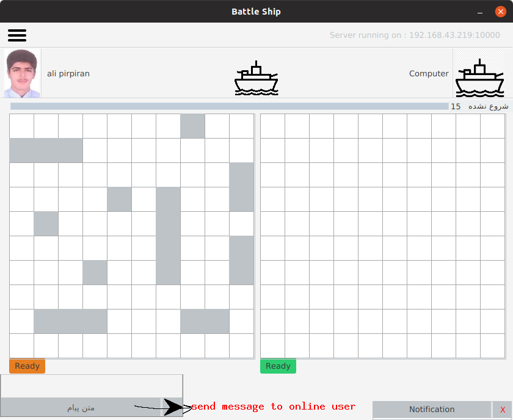

<h2>
    Battle Ship Game
</h2>

<h3>
1-    login window
</h3>

<h3>
2-    now we should start server or connect to server if started (locally or by other pc)
</h3>

<h3>
2-    we start server 
the datas are loaded from our pc because we started server locally
</h3>

<strong>
if you have account sign in with your username and password 
or create a new account
</strong>

 

<h3>
    play with computer
</h3>

    1- easy  
    2- normal  
    3- hard 

 

<h3>
move your ships  
the click on ready  
first move is for pc  
turns are showed with little green circle next to user's name  
you have 15 secconds to move   
</h3>

<h2>
    Notes
 <ul>
    <li> you can click on any users photo and see its profile</li>
    <li> after game finished your game result will save to DataBase </li>
 </ul>
</h2>